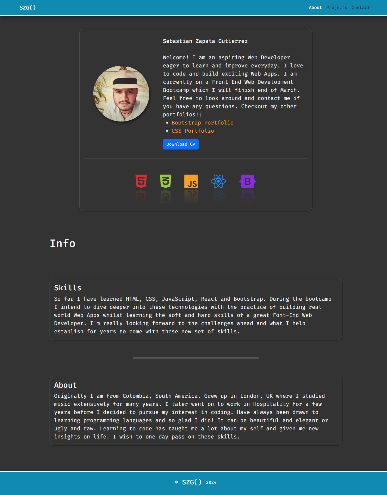
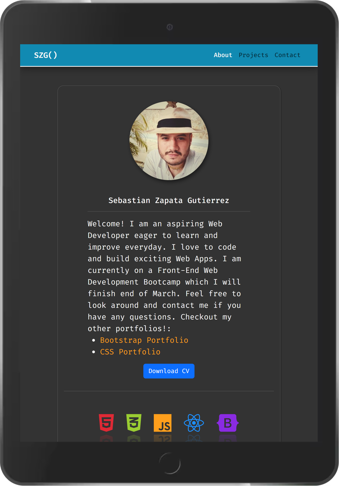
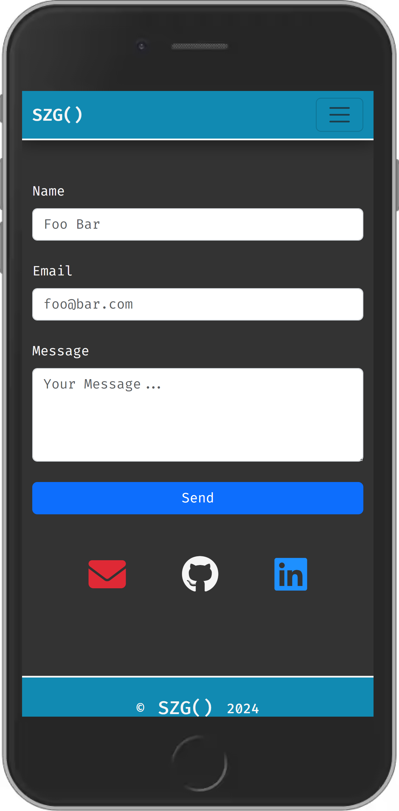

# React Portfolio

My Portfolio remade with the power of React + React-Bootstrap. Here I take advantage of React's component-based architecture, state management capabilities, and the rich UI components provided by React-Bootstrap to create a modern and interactive user experience.

[**Deployed Project**](https://szg-dev.netlify.app/)

##
### Technologies / Languages
 - JavaScript
 - React
 - React-Bootstrap

##
### Resources
- [**Vite**](https://vitejs.dev/)
- [**React-Bootstrap**](https://react-bootstrap.netlify.app/)

##
### Desktop

##
### Tablet

##
### Mobile

